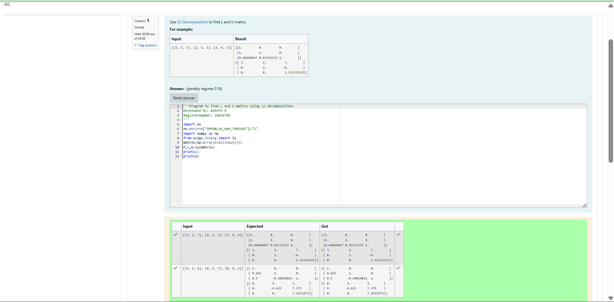
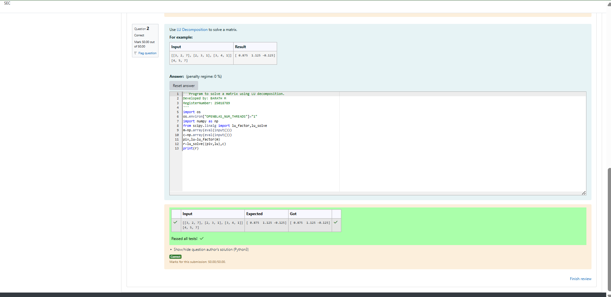

# LU Decomposition 

## AIM:
To write a program to find the LU Decomposition of a matrix.

## Equipments Required:
1. Hardware – PCs
2. Anaconda – Python 3.7 Installation / Moodle-Code Runner

## Algorithm
 1.Read the input matrix A and store it as an array.
 2. Apply LU decomposition on matrix A to factor it into L (lower triangular matrix) and U (upper triangular matrix).
 3.Extract the L matrix and U matrix from the decomposition result. 
 4.Print the L matrix and U matrix as the output.
## Program:
(i) To find the L and U matrix
```
/*
Program to find the L and U matrix.
Developed by: Barath M
RegisterNumber:212225220016
*/
import os
os.environ["OPENBLAS_NUM_THREADS"]="1"
import numpy as np
from scipy.linalg import lu
matrix=np.array(eval(input()))
P,L,U=lu(matrix)
print(L)
print(U)
```
(ii) To find the LU Decomposition of a matrix
```
/*
Program to find the LU Decomposition of a matrix.
Developed by:Barath M
RegisterNumber:212225220016
*/
import os
os.environ["OPENBLAS_NUM_THREADS"]="1"
import numpy as np
from scipy.linalg import lu_factor,lu_solve
m=np.array(eval(input()))
c=np.array(eval(input()))
piv,lu=lu_factor(m)
r=lu_solve((piv,lu),c)
print(r)
```

## Output:




## Result:
Thus the program to find the LU Decomposition of a matrix is written and verified using python programming.

